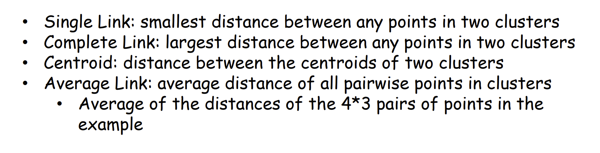
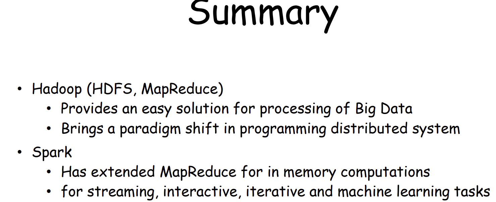
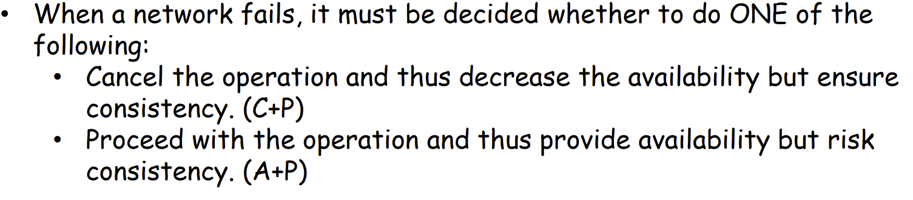
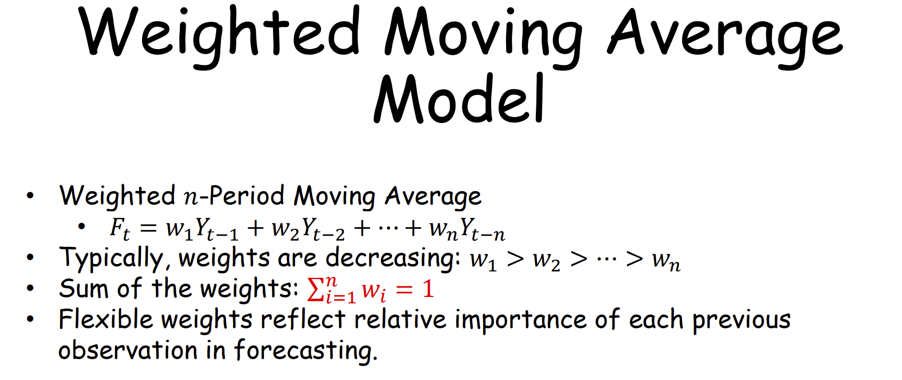
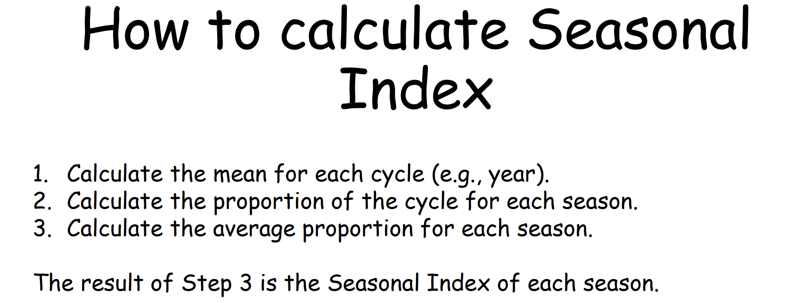

## handout 1

## handout 2

-----------------

## handout 3

----------------

------------------

## handout 4

## handout 5

​	

-------------------

-----------------

----------------

## handout 6

## handout 7

-----------------

----------------

$$
N(v_i) = Neighbors(v_i)
$$

--------------

---------------------------

## handout 8

------------

------------------

## handout 9

--------

Step 1:  mean(4 seasons) for each year

Step 2:  season value / mean  ,  for each year 

Step 3:  average proportion , for each season

-----------------

## handout 10

---------

