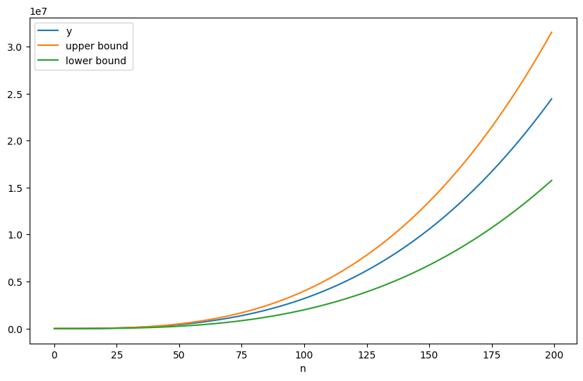

# Q1

* insert 12


* insert 23

.png)

* insert 34

.png)

rotation

.png)

* insert 45

.png)

* insert 56

.png)

rotation

.png)

* insert 67

.png)

rotation

.png)

* insert 78

.png)

rotation

.png)

* insert 89

finally

.png)

# Q2


```python
class Node:
    def __init__(self, val=None, pre=None, nex=None):
        self.val = val
        self.pre = pre
        self.nex = nex

def merge_nodes(node_pre: Node, node_suf: Node):
    if not node_pre and not node_suf:
        return
    if not node_pre:
        node_suf.pre = None
    elif not node_suf:
        node_pre.nex = None
    elif not node_suf.pre:
        node_pre.nex, node_suf.pre = node_suf, node_pre
    else:
        node_suf.pre.nex = node_pre
        node_pre.pre = node_suf.pre
        node_suf.pre = node_pre
        node_pre.nex = node_suf

def merge_linked_list(head1: Node, head2: Node) -> Node:
    head = head1
    if not head1 and not head2:
        return None
    if not head1:
        return head2
    if not head2:
        return head1
    node1, node2 = head1, head2
    while node1 and node2:
        if node1.val < node2.val:
            tmp = node1.nex
            merge_nodes(node1, node2)
            node1 = tmp
        else:
            if not node2.nex:
                break
            node2 = node2.nex

    merge_nodes(node2, node1)
    while head.pre:
        head = head.pre
    return head

def print_linked_list(head: Node):
    while head:
        print(head.val, end=' ')
        head = head.nex

def array_to_linked_list(arr: list[int]) -> Node:
    head = Node()
    node = head
    for val in arr:
        new_node = Node(val)
        node.nex, new_node.pre = new_node, node
        node = new_node
    ret, head.nex.pre = head.nex, None
    return ret

def main():
    L = array_to_linked_list([1, 3, 5, 7, 9, 11])
    R = array_to_linked_list([2, 4, 6, 8, 10])
    head = merge_linked_list(L, R)
    print_linked_list(head)

main()
```

# Q3

since
$$
\lim_{n\to\infin}  \frac{3n^3+20n^2+5}{n^3}=3
$$
we have  $\forall \epsilon >0, \ \exist n_0>0, \ s.t. \forall n>n_0, $
$$
|\frac{3n^3+20n^2+5}{n^3}-3|<\epsilon
$$
we can find a specific coefficients satisfying formula above,

if $\epsilon=1$ , $\ n_0=100$, then $c=4$.

```python
import matplotlib.pyplot as plt
import numpy as np

x = np.arange(0, 200, 1)
y1 = np.power(x, 3)*3 + 20*np.power(x, 2) + 5*x
y2 = np.power(x, 3)*4
y3 = np.power(x, 3)*2
plt.figure(figsize=(10, 6))
plt.plot(x, y1, label='y')
plt.plot(x, y2, label='upper bound')
plt.plot(x, y3, label='lower bound')
plt.xlabel('n')
plt.legend()
plt.show()
```


