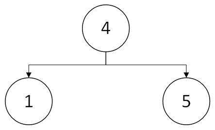
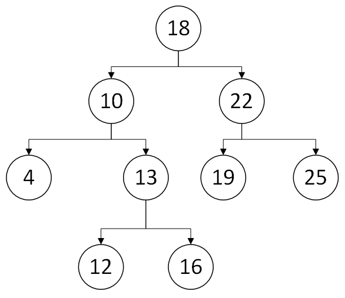

# Question 1

* Binary search tree with height 2

* Binary search tree with height 4

.png)

* Binary search tree with height 6

.png)

# Question 2

# Question 3

* original

* after left rotation of node 10 and node 13

.png)

* after right rotation of node 13 and node 18

.png)
