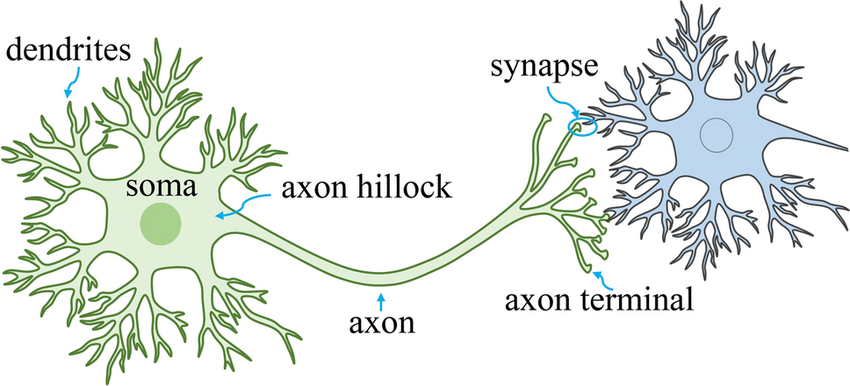

# review 1

## mechanism of neural signaling regulation

**connectomes** denote the connections in whole neural populations.

connectomes hold some topological properties:

1. **core of densely interconnected hubs**: these hubs are highly interconnect with each other and highly communicate with other regions.
2. **modular and hierarchical structure**: modular structure, hierarchical denotes brain includes high-level modules and low-level modules.
3. **small-world architecture**: high degree of clustering, short characteristic path length. often use as some metrics.

## brain network communication models

* **routing protocols**

​	signaling takes place via a small number of efficient, selectively accessed paths (shortest path protocol, navigation protocol, etc.)

* **diffusion models**

​	signals diffuse through the connectome, potentially spreading simultaneously along multiple network fronts or following random walk dynamics

* **parametric models**

​	combine elements of routing and diffusion

-------------------------------------------

**pros and cons about routing protocols and diffusion models**

* **0. metric**

* delay cost, information cost, energetic cost

  > The previous paragraph introduces three dimensions of network
  > communication **cost**: **delay, information and energy**. The delay cost
  > refers to the topological efficiency (or speed) of signal transmission;
  > the informational cost refers to the amount of knowledge of network
  > properties required to guide signal propagation; and the energetic cost
  > refers to the amount of metabolic resources necessary for signaling.

  > **energetic cost**: In other words, when neurons communicate with each other, they need to expend energy to generate and propagate action potentials, release and reuptake neurotransmitters, and maintain the necessary ionic gradients across their membranes. This energy expenditure is known as the energetic cost of neural signaling.

* **1. routing protocols**: 

  mandates strong assumptions about the amount of topological information. 

* comparison between : **shortest path and navigation**

* ‘fine-grained, coarse-grained, fine-grained’ propagation pattern

* **2. diffusion process**

> benefit from low informational costs but suffer from elevated signaling delays and energetic costs.

* **random walk**
* **Broadcasting (communicability)**

* **3. parametric models**

* **linear threshold model**