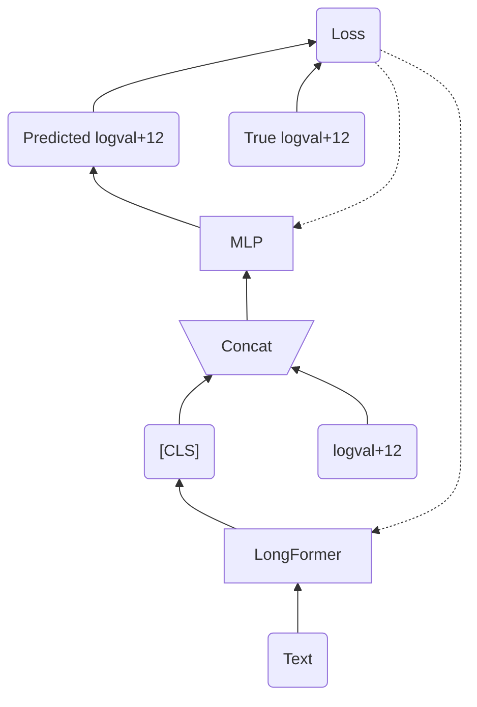
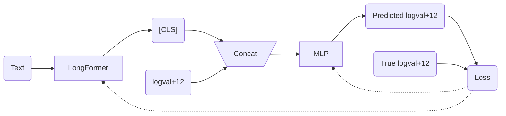
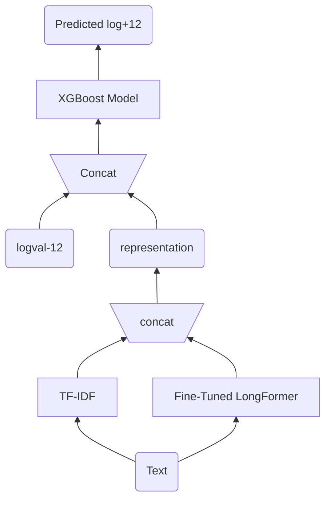
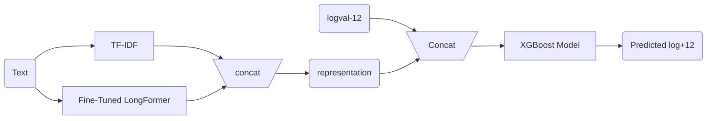
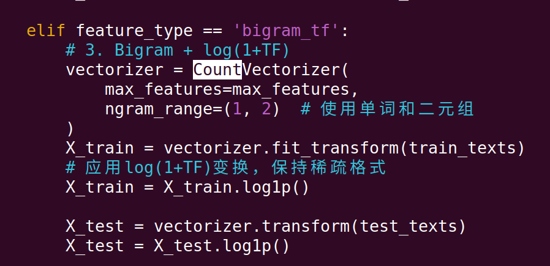

## Main goal of our project

This study analyzes corporate annual financial reports to explore the predictive ability of textual features on future stock price volatility. We evaluate the performance of various textual data representations in a regression task applying the XGBoost model.

## Conclusion

In the representation extracted from textual datasets, we propose a novel representation that combines TF-IDF with LongFormer. The TF-IDF features effectively captures significant information from specific financial terminology but remains context-agnostic, whereas LongFormer provides a context-based representation. This combined approach demonstrates enhanced performance. 

1. ppt slice 8

**Fine-Tuning Step**

二选一，方向不同，内容完全一样

2. ppt slice P9

**Prediction Step based on XGBoost**

-----------------------------------

任务：

前面的问题介绍和后面的数据展示你讲，中间的架构和特征我来讲（P6 - P9)

-------------------------------

第一，你看看你的`train.py`代码

什么是`CountVectorizer`, 你查了看一下，就是词频，就是TF,  ppt第6页，你看看是修改还是和TF-IDF合并

**删除第7页**

第二， 13页，第一和第三改一下，我希望的研究结果是：

1. 证明xgboost比svr好（最好说明一下你用的是linear svr还是kernel svr）
2. 对于textual data extraction, 我们认为TF-IDF + bert 效果最好，比单独的bert或者是单独的TF-IDF好

