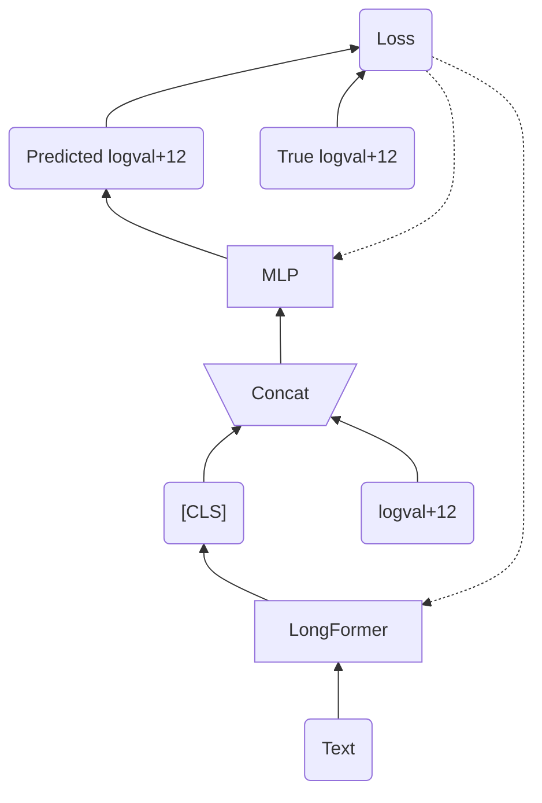
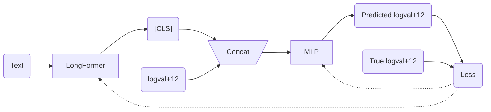
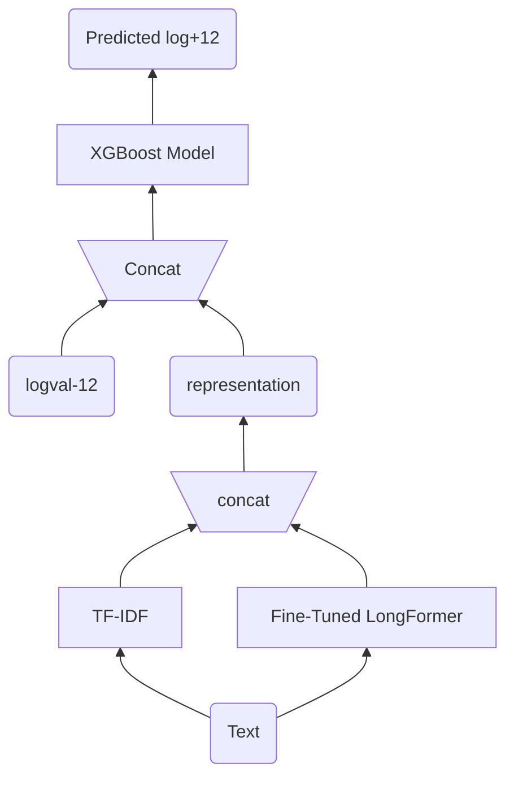
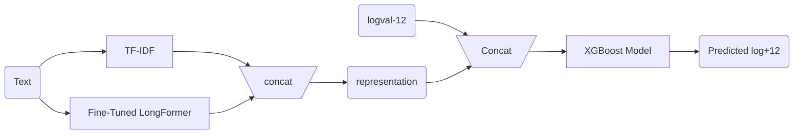

下面这个是slice 2 的修改， 酌情修改：

## Main goal of our project

This study analyzes corporate annual financial reports to explore the predictive ability of textual features on future stock price volatility. We evaluate the performance of various textual data representations in a regression task applying the XGBoost model.

## Conclusion

In the representation extracted from textual datasets, we propose a novel representation that combines TF-IDF with LongFormer. The TF-IDF features effectively captures significant information from specific financial terminology but remains context-agnostic, whereas LongFormer provides a context-based representation. This combined approach demonstrates enhanced performance. 

-----------------------------------

图我等一下生成一个，你的图不是AI论文里面的通用格式，有点业余

1. ppt slice 8

**Fine-Tuning Step**

二选一，方向不同，内容完全一样

2. ppt slice P9

**Prediction Step based on XGBoost**

-----------------------------------

